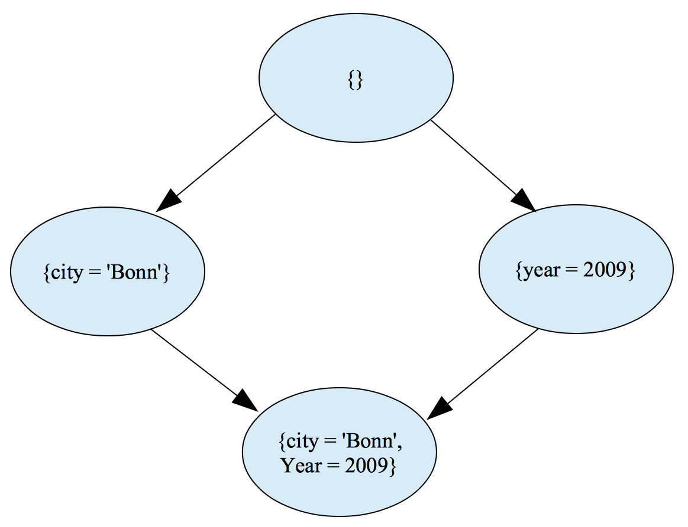

# A tutorial for outlier detection based on sub-population

## What is outlier detection, or anomaly detection?

Outlier detection (also called anomaly detection) refers to the problem of finding patterns in data that do not conform to the expected normal behavior.
Different approaches share the same basic idea: to define certain model as normal cases, outliers are defined as those cases which do not fit the model.
For example, we can define normal cases of heart beat rates as follows: (1) for children 10 years and older,
and adults (including seniors) is 60 - 100 beats per minute; (2) for well-trained athletes is 40 - 60 beats per minute.
So, an adult whose heart beats 40 times per minute is abnormal, and should see the doctor. A well-trained athlete
whose heart beats 100 times per minute is an abnormal case. This example introduces an important concepts in
outlier-detection: subpopulation.

## Local Outlier Factors based on Subpopulation
Whether an object is normal or abnormal within a group, largely relates to the way we define the group.
A man with the height of 1.60 meter is abnormal in north Europe, but normal in the south of Asia.
People die at the age of  40 is normal in some African countries, but abnormal in European countries.
To identify abnormal data in a large dataset, we need to delineate groups to which this data belong.
This introduces the subpopulation-based outlier detection method, i.e. Fleischhacker, et al. (2014)

Fleischhacker, et al. (2014). Fleischhacker, D., Paulheim, H. Bryl, Völker, J., Bizer, Ch.
Detecting Errors in Numerical Linked Data using Cross-Checked Outlier Detection.
In: 13th International Semantic Web Conference, pp 357-372, Riva del Garda, Italy, October 19-23, 2014. Proceedings, Part I.

### Generating possible constraints
Constraints can be set to the class or to the property. The descriptions “children 10 years and older, adults, well-trained athletes”
in the heart-beating rate example contains classes as constraints: “children”, “adult”, and “athlete”, properties as
constraints: “well-trained”, property values as constraints: “10 years and older”. Based on OBEU data model,
constraints for OBEU dataset are limited to property values, such as “year = 2009”, “budgetPhase=approved”,
“administrativeClassification = <value>”,  “economicClassification = <value>”,  “functionalClassification = <value>”.
Given one or more datasets, we first collect all these property-value pairs, as basic constraints.

### Finding subpopulations
Each basic constraint partitions the whole set of measures into two subsets -- either satisfying the constraint, or not.
Adding a new constraint to a subset might split it into two. Using the generated constraints, we can generate a lattice of
subpopulations. Each node corresponds to a set of satisfied constraints (a one to one mapping). A child node satisfies more
constraints than the parent nodes, as illustrated below.

<p align="center">
  
</p>


# Quick start

An open source data-mining tool has been developed following the methods described by Fleischhacker, et al. (2014),
and downloadable at https://github.com/openbudgets/outlier_dm

```
$ git clone https://github.com/openbudgets/outlier_dm.git
$ cd outlier_dm
outlier_dm $ make init
```

## Run at shell
```
$ python3 main.py --help
Usage: main.py [OPTIONS]

  input data can be a csv file, or a link of the json file :param csv:
  :param link: :return:

Options:
  --csv TEXT   path of the input file in csv format
  --link TEXT  link of the input file in json format
  --help       Show this message and exit.
```

```
$ python3 main.py --link http://ws307.math.auth.gr/rudolf/public/api/3/cubes/aragon-2008-income__568a8/facts
```

```
$ python3 main.py --csv data/Kilkis_neu.csv
```

## Run test
```
outlier_dm $ make test
```

## Generate documentation
```
outlier_dm $ ./make_docu
```
Documentation is located at docs/html/

## import into iPython

```
$ iPython

In [1]: import outlier_dm
```
